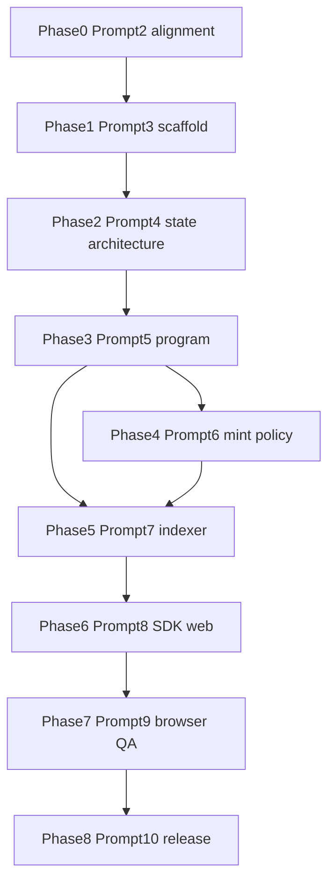

# Holder v. Holder — full platform execution plan

## Current baseline ([`c:\Users\Benna\Downloads\trenchz (1)`](c:\Users\Benna\Downloads\trenchz (1)))

**Already present**

- [`AGENTS.md`](AGENTS.md), [`ops/cursor/orchestrator/*`](ops/cursor/orchestrator/ORCHESTRATOR.md), [`ops/cursor/subagents/*.md`](ops/cursor/subagents/spec-guardian.md) (10 roles), [`ops/cursor/skills/*/SKILL.md`](ops/cursor/skills/architecture-decision-records/SKILL.md) (8 skills), [`ops/cursor/hooks/*.sh`](ops/cursor/hooks/block-dangerous-commands.sh), [`ops/cursor/prompts/*.txt`](ops/cursor/prompts/new-epic.txt), [`.cursor/rules/holder-platform.mdc`](.cursor/rules/holder-platform.mdc).

**Gaps vs your Prompt 2 checklist**

| Area | Gap |
|------|-----|
| **Rules** | You have `00–04` with different numbering/topics than Prompt 2 (`02-mint-policy`, `03-indexer-read-model`, `04-web-backend`, `05-testing-release`, `06-no-timer`). Current `02-web-backend` + `03-testing` need **split/rename** and **new mint-policy + indexer** rule files; renumber to match Prompt 2 or update `.cursor/rules` references. |
| **Hooks** | [`require-tests-on-merge.sh`](ops/cursor/hooks/require-tests-on-merge.sh) should align with Prompt 2 name **`require-tests-on-program-changes.sh`** (add script + README pointer; keep or symlink old name if anything references it). |
| **Specs / ADR / runbooks** | Only [`docs/specs/README.md`](docs/specs/README.md), [`docs/adr/README.md`](docs/adr/README.md), [`docs/runbooks/README.md`](docs/runbooks/README.md). Missing: `product-spec.md`, `invariants.md`, `mint-policy.md`, `system-boundaries.md`, `ADR-001-platform-charter.md`, `indexer-replay.md`, `release-verification.md`. |
| **Subagents / skills** | Files exist but are **lighter** than Prompt 2’s contract (mission, forbidden scope, quality gates, failure conditions, handoff). **Upgrade** each file to match the meta-prompt structure. |
| **Cursor agent config** | [`.cursor/agents/trenchz.md`](.cursor/agents/trenchz.md) still describes the **legacy Vite tournament** (timers, mock wallet). **Replace or add** an orchestrator/HvH agent so delegation does not contradict [`AGENTS.md`](AGENTS.md). |
| **Product code** | No `programs/holder_arena`, `apps/web` (Next), `apps/indexer`, `packages/sdk`, `packages/shared`, or `tests/*` as in Prompt 3. Root app remains **Vite** ([`package.json`](package.json), [`App.tsx`](App.tsx)). |

---

## Guiding principles (enforced every phase)

- **Chain = truth**; Postgres/indexer = projection only.
- **No timers, no wallet-balance watcher, no offchain winner selection** (remove or quarantine legacy UI patterns when touching product surfaces).
- **Worktrees / best-of-n** for competing PDA layouts, indexer replay strategies, or IA forks—**not** improvised on `main` ([Cursor worktrees](https://cursor.com/docs/configuration/worktrees)).
- Every specialist return uses [`ops/cursor/orchestrator/HANDOFF_TEMPLATE.md`](ops/cursor/orchestrator/HANDOFF_TEMPLATE.md); merge uses [`DONE_CRITERIA.md`](ops/cursor/orchestrator/DONE_CRITERIA.md).

---

## Phase 0 — Prompt 2 alignment (operating pack complete)

**Goal:** Repo matches your Prompt 2 file list and content bar before Prompt 3.

1. **Rules:** Add/split to exactly: `02-mint-policy.md`, `03-indexer-read-model.md`, `04-web-backend-boundaries.md`, `05-testing-release.md`, `06-no-timer-no-offchain-settlement.md`; migrate content from current `01–04` without losing constraints; keep `00-platform-charter.md` and `01-solana-contract-safety.md`. Update [`ops/cursor/README.md`](ops/cursor/README.md) and [`.cursor/rules/holder-platform.mdc`](.cursor/rules/holder-platform.mdc) to list the final rule set.
2. **Hooks:** Add `require-tests-on-program-changes.sh` (CI-oriented stub + doc); deprecate or alias `require-tests-on-merge.sh`.
3. **Docs:** Author production-quality [`docs/specs/product-spec.md`](docs/specs/product-spec.md), [`invariants.md`](docs/specs/invariants.md), [`mint-policy.md`](docs/specs/mint-policy.md), [`system-boundaries.md`](docs/specs/system-boundaries.md); [`docs/adr/ADR-001-platform-charter.md`](docs/adr/ADR-001-platform-charter.md); [`docs/runbooks/indexer-replay.md`](docs/runbooks/indexer-replay.md), [`release-verification.md`](docs/runbooks/release-verification.md)—grounded in your canonical rules (recruiting/live/finalize, final 3, surrender economics, per-position vaults).
4. **Subagents / skills:** Expand each to Prompt 2’s required sections (mission, owned/forbidden scope, inputs, process, deliverables, quality gates, failure conditions, handoff).
5. **Optional:** Add [`ops/cursor/prompts/prompt-01-bootstrap.md`](ops/cursor/prompts/) … `prompt-10-release.md` as **verbatim copies** of your paste blocks for repeatable use.

**Gate:** Human/orchestrator sign-off that Prompt 2 checklist is satisfied; then treat Prompts 1–2 as **done** and skip re-running them unless you want a clean audit trail.

---

## Phase 1 — Prompt 3: Monorepo scaffold (skeletons only)

**Goal:** Directory layout and build wiring **without** full business logic.

**Recommended layout** (matches your Prompt 3; adjust tool choice in implementation):

- **Root:** `package.json` with **npm workspaces** (or pnpm if you standardize on pnpm)—workspaces: `apps/*`, `packages/*`, optionally `programs` excluded from Node workspace if Anchor uses separate tooling.
- **`programs/holder_arena/`:** Anchor workspace member; `Anchor.toml`, `lib.rs` + `state/`, `instructions/` **stubs**, `constants.rs`, `errors.rs`, events stub.
- **`packages/shared`:** Zod/schemas, shared constants, event type names (align with IDL later).
- **`packages/sdk`:** PDA helpers + ix builders **stubs** (consume IDL path from `target/idl` once built).
- **`apps/indexer`:** TypeScript service entry (`main.ts`, `config`, `rpc`, `subscriptions`, `reconciliation`, `db`, `handlers/*`) + **SQL migrations** skeleton under [`infra/migrations`](infra/) or `apps/indexer/migrations`.
- **`apps/web`:** **Next.js App Router** (TypeScript, Tailwind), routes stubbed per spec: `(public)/`, `api/auth/*`, `api/arenas/*`, `middleware.ts`.
- **`tests/program`**, **`tests/integration`**, **`tests/e2e`:** Placeholders + one smoke test or `README` describing harness.
- **Legacy Vite app:** **Decision in implementation:** move to `apps/legacy-trenchz-ui` or `archive/vite-demo` and exclude from default workspace **or** delete after extracting any branding you want in Next. Do **not** leave two competing “product” apps without an explicit ADR.

**Gate:** `anchor build` succeeds (stub program); `pnpm/npm` install at root; Next dev starts; indexer `package.json` script exists; no contradictory game rules in stub comments.

---

## Phase 2 — Prompt 4: Solana state architecture (lock before heavy Rust)

**Delegates:** spec-guardian, solana-state-architect.

**Deliverables:** Full account schemas, PDA seed table, state transition matrix, event schema, sizing notes, attack-surface notes; update [`docs/specs/invariants.md`](docs/specs/invariants.md) and [`system-boundaries.md`](docs/specs/system-boundaries.md); new ADRs only if decisions branch (e.g. explicit accounts passed for `finalize_if_three_left` vs alternative).

**Worktree trigger:** If two credible finalize/join account layouts exist, run **best-of-n** and pick one via ADR.

**Gate:** Orchestrator + security-reviewer **read-only** pass on PDA/signer model before Prompt 5.

---

## Phase 3 — Prompt 5: Anchor implementation + program tests

**Delegates:** solana-program-implementer, security-reviewer.

**Implement:** All instructions (`initialize_config` … `claim_winnings`), constraints, CPIs (system + ATA + token programs only), events, errors; comprehensive tests listed in Prompt 5.

**Gate:** All program tests green; invariant map in PR; no admin payout path.

---

## Phase 4 — Prompt 6: Mint policy engine

**Delegates:** mint-policy-auditor, security-reviewer (and program touch for `set_mint_policy` validation).

**Deliverables:** On-chain checks aligned with [`docs/specs/mint-policy.md`](docs/specs/mint-policy.md); tests for rejected extensions/authorities; admin UI field list for later.

---

## Phase 5 — Prompt 7: Indexer + read APIs

**Delegates:** indexer-backend-engineer.

**Implement:** WS subscriptions + replay + idempotent event keying; Postgres tables (`arenas`, `positions`, `events`, auth/session/mint_policies per your earlier spec); HTTP read API consumed by Next (or BFF routes proxying to indexer).

**Gate:** Documented rebuild from slot; disconnect recovery; mismatch detection strategy (sample: periodic spot-check vs RPC).

---

## Phase 6 — Prompt 8: SDK + Next.js web

**Delegates:** sdk-client-engineer, web-ui-engineer.

**Implement:** Typed SDK from IDL; wallet + tx flows; pages: arenas, detail, me, admin; auth nonce/verify routes; tx status route; **no fake arena data** once APIs exist.

**Gate:** E2E-ready flows behind feature flags if needed; explicit tx states in UI.

---

## Phase 7 — Prompt 9: Browser QA

**Delegates:** browser-e2e-agent, security-reviewer.

**Use Cursor browser tools** for flows in Prompt 9; produce prioritized defect list; optional Playwright in `tests/e2e` for regression.

---

## Phase 8 — Prompt 10: Release + verification

**Delegates:** release-verification-agent, security-reviewer.

**Deliverables:** Verifiable build doc/procedure, deployment manifest, env inventory, rollback runbooks, post-deploy checklist; confirm no critical security TODOs.

---

## Dependency graph (high level)

Mint policy (P4) can overlap **late** with indexer (P5) once program interfaces are stable; strict sequencing above avoids decoder drift.

---

## Merge, test, and release gates (summary)

| Stage | Merge gate | Test gate |
|-------|------------|-----------|
| Phase 0 | Docs/rules reviewed | N/A |
| Phase 1 | Monorepo builds | Stub builds |
| Phase 2 | ADR/spec approved | N/A |
| Phase 3 | security-reviewer on money path | Full program + negative tests |
| Phase 4 | Policy matrix matches code | Policy rejection tests |
| Phase 5 | No settlement in API | Replay/idempotency tests or scripted replay |
| Phase 6 | Auth/session review | Manual or automated critical flows |
| Phase 7 | Defect burn-down | Browser pass/fail matrix |
| Phase 8 | Artifact checklist | Post-deploy validation script |

---

## Risks and open questions

- **Legacy Vite product** contradicts HvH rules (timers, mock PnL). Resolve explicitly when scaffolding Next (relocate, delete, or re-theme as non-protocol marketing only).
- **Git root:** User-level git status previously pointed at `C:/Users/Benna` as repo root; ensure **this project** uses its **own** git repo for worktrees/best-of-n to behave as intended.
- **Toolchain:** Pin Solana/Anchor/Rust versions early (Phase 1) for verifiable builds in Phase 8.

---

## What to paste next (operational)

After you approve this plan in Agent mode:

1. **If Prompt 2 parity matters:** Run your **Prompt 2** text (or delegate “Phase 0 only”) so the repo matches the exact file list.
2. Then run **Prompt 3** for scaffold, or ask the orchestrator to “execute Phase 1 of the approved plan.”

No need to re-run **Prompt 1** unless you want a fresh written architecture doc—the plan above subsumes its outputs.
