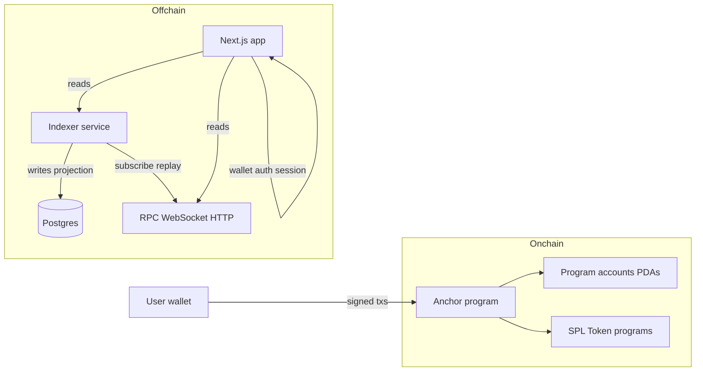

# System boundaries — Holder v. Holder

## Trust boundaries

## What each layer may do

| Layer | May | Must not |
|-------|-----|----------|
| **Program** | Enforce rules; move tokens per CPI rules; emit events | Rely on offchain truth for eligibility |
| **Indexer** | Subscribe, decode, persist, replay | Select winners; settle; custody keys |
| **DB** | Cache queryable state | Become source of truth when chain disagrees |
| **Web API** | Read model + auth + tx status helpers | Sign user transactions with custodial keys |
| **Wallet auth** | Personalize reads and admin UI sessions | Replace program signer checks |

## Data classification

- **Public**: Program id, arena addresses, instruction layout, indexer read API (rate-limited).
- **Sensitive**: Operator RPC URLs, DB credentials, session secrets — not committed; env-only.

## Inter-service boundaries (MVP)

- Indexer consumes **chain** and writes **DB**; web consumes **indexer HTTP** for lists/detail and **RPC** for confirmation.
- No “admin” microservice that executes transfers; admin actions are **client-signed** instructions.
